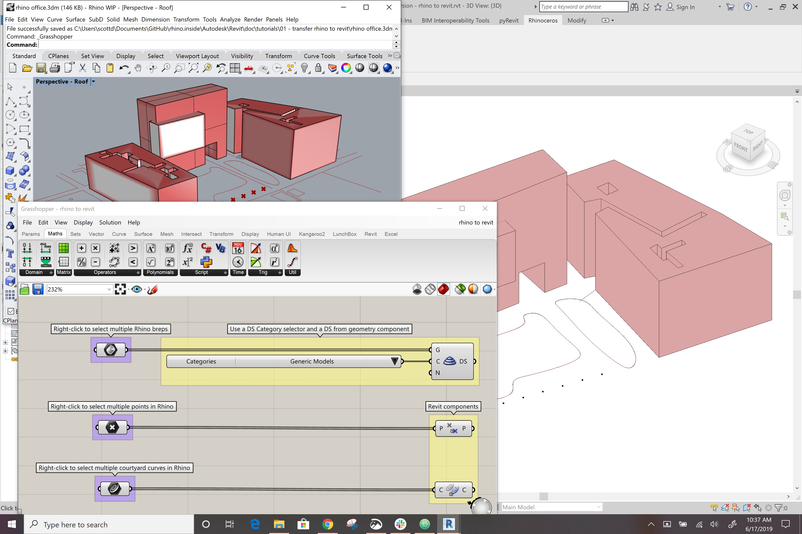

# Bringing Rhino&reg; Geometry into Revit&reg;
This sample shows how to take normal Rhino breps, curves and points into Revit.

There are a lot of ways to bring in the Rhino geometry, but in this case we will be bringing them in as DirectShape elements.

### Bringing Breps into a Revit category
Rhino surfaces and brep solids can be imported into Revit as a categorized DirectShape.

Open Sample files:
1. Open the [Rhino to Revit.rvt](/rhino_to_revit.rvt) in Revit.
1. Start Rhino inside Revit and open the [Rhino office.3dm](/rhino_office.3dm) file.
1. Start Grasshopper within Rhino.

The component necessary:
1. DirectShape Category picker
1. Directshape from Geometry
1. Brep Param component in Grasshopper

Once you select the Breps, those will feed into the Direct component.

### Live-linking Points from Rhino into Revit
Rhino curves can be linked/embedded into Revit and Grasshopper will keep them up to date.

The component necessary:
1. Curve from Geometry
1. Curve Param component in Grasshopper

Once you select the curves, those will feed into Revit.

### Bringing in complex curves into Revit
Rhino points can be linked/embedded into Revit and Grasshopper will keep them up to date.

The component necessary:
1. Curve from Geometry
1. Curve Param component in Grasshopper

Once you select the points, those will feed into Revit.
