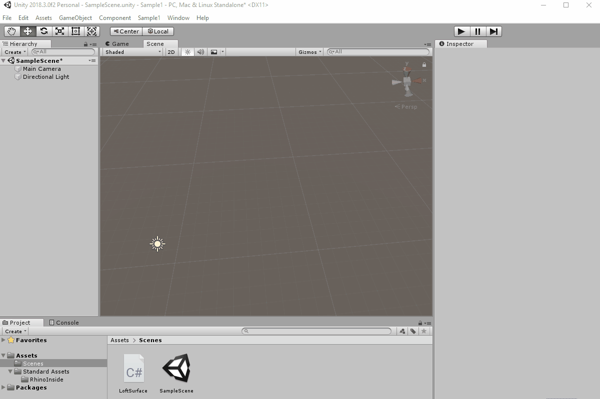

# Rhino Inside Unity
The Rhino Inside technology allows Rhino and Grasshopper to be embedded within other products.

This folder contains a sample project that demonstrates:

1. Starting Rhino in Unity.
2. Call directly into RhinoCommon APIs from Unity.

[**Questions?** *Visit the discussion forum...*](https://discourse.mcneel.com/c/serengeti/inside)

## Getting started
These instructions will get you a copy of the project up and running on your local machine for development and testing purposes.

### Prerequisites
* Git client. ([download](https://git-scm.com/downloads))
* Rhino WIP ([download](https://www.rhino3d.com/download/rhino/wip))
* Unity 2018.3 ([download](https://unity3d.com/get-unity/download))

### Getting Source & Build
1. Clone the repository. At the command prompt, enter the following command:
```
git clone --recursive https://github.com/mcneel/rhino.inside.git rhino.inside
```
2. Go to _rhino.inside\Unity\Sample1\Assets\Standard Assets\RhinoInside_ folder and double click on _RhinoCommon.Update.bat_.

## Using the samples
* Run Unity and open the _rhino.inside\Unity\Sample1_ project folder.
* Rhino WIP should load inside Unity.

### Sample 1


1. Go to the Unity main menu bar.
2. Click on _Sample1/Create Loft Surface_.
3. You should have a Lofted surface in the Unity scene.
4. You can adjust the control balls and the surface will be reevaluated.

_Thanks to [Long Nguyen](https://github.com/LongNguyenP) for his contribution to this Sample_
